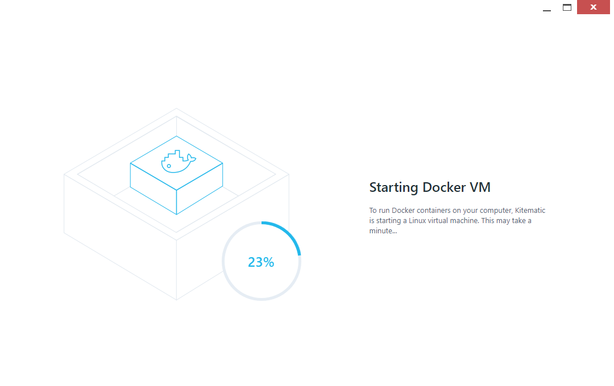
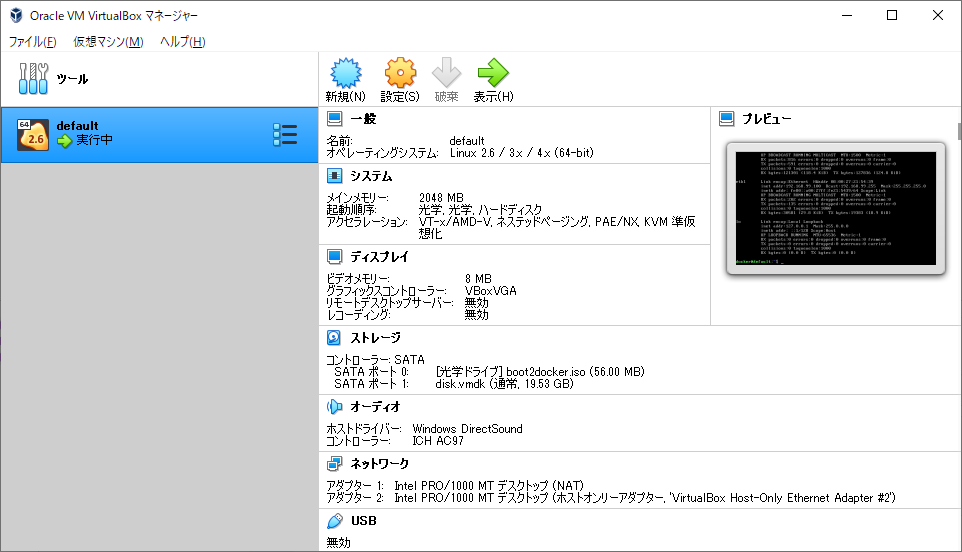
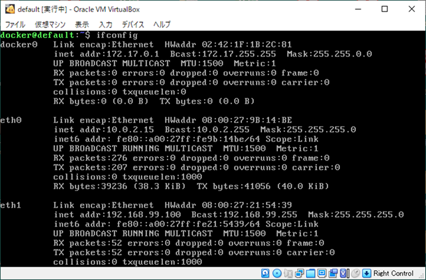
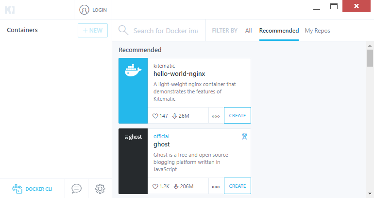
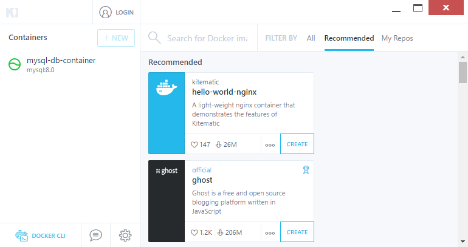

# Docker Toolbox 
レガシーな Windows 向けの Docker マネージメントツール、Docker Toolbox について説明する。
ここでは、Docker Toolbox で docker-compose ファイルを使ってコンテナを起動するところまで確認する。

## Docker Toolbox とは 

## VirtualBox のインストール
VirtualBox がまだインストールされていない場合は、Chocolatey で VirtualBox をインストールする。

Chocolatey を導入していない場合は、以下を参照する。

Chocolatey のインストール方法：  
https://github.com/fs5013-furi-sutao/explain.how_to_install_chocolatey

インストールするには、管理者で開いた PowerShell で以下のコマンドを実行する。

```console
choco install virtualbox
```

## Docker 類のインストール
Docker Toolbox を使うには、以下の 3 つのモジュールが必要になる。
- docker
- docker-machine
- docker-compose

今回はこれらを scoop でインストールする。


すでに Scoop を導入している場合は、以下のコマンドで Docker の3つのモジュールを一度にインストールができる。

```console
scoop install docker docker-machine docker-compose
```

これらのモジュールを Scoop でインストールすると、Docker Toolbox の GUI である Kitematic が同時にインストールされる。

## Kitematic の起動
インストールされた Kitematic を起動する。

 

## Docker Toolbox でのコンテナ構造
レガシーな（2004 より前のバージョン）Windows 10 では、Docker Toolbox を使う。

通常の Linux 向けの Docker と違い、Docker Toolbox は VirtualBox で作った default という初期 Virtual Machine の上に Docker コンテナを構築する。

そのため、Docker コンテナへ接続できる IP アドレスも、この default VM の IP アドレスになる。

## default VM の IP アドレスの確認方法
default VM の IP アドレスを確認するには、VirtualBox を立ち上げる。

以下の VirtualBox のホーム画面を見て分かる通り、Kitematic の初回起動により、default という VM が作成・実行されていることが分かる。



この default をダブルクリックすることで、default VM のコンソール画面が表示される。コンソールに、以下のコマンドを実行し、IP アドレスの情報を表示させる。

```console
ifconfig
```

以下の場合、default VM の IP アドレスが `192.168.99.100` であることが分かる。



また、このようなネットワーク情報は、以下のコマンドで PowerShell などで見ることもできる。

```console
VBoxManage guestproperty enumerate "default" | findstr IP
```

コマンド実行結果：
```
Name: /VirtualBox/GuestInfo/Net/0/V4/IP, value: 10.0.2.15, timestamp: 1599918604633024103, flags:
Name: /VirtualBox/GuestInfo/Net/2/V4/IP, value: 172.17.0.1, timestamp: 1599918604635956100, flags:
Name: /VirtualBox/GuestInfo/Net/1/V4/IP, value: 192.168.99.100, timestamp: 1599918604634001203, flags:
```

## Docker コンテナを起動してみる
試しに DB コンテナを起動してみる。今回は、以下のリポジトリを使って MySQL を動かす。

MySQL 8.0 コンテナの Docker Compose ファイル：  
https://github.com/fs5013-furi-sutao/fsedu.mysql.8.0

作業をしたいディレクトリに移動し、Git Bash で以下のコマンドを実行してリポジトリをクローンする。

```console
git clone https://github.com/fs5013-furi-sutao/fsedu.mysql.8.0.git
```

これで Docker を起動させるためのファイルは準備できたのだが、通常の PowerShell やコマンドプロンプト、Git Bash などでは、Docker を起動させるコマンドを実行できない。

Docker コマンドを実行するには、Docker CLI を利用する。

## Docker CLI
Docker CLI を起動するボタンは、Kitematic にある。Kitematic 画面の左下コーナーを見ると「Docker CLI」というボタンがあるので、これをクリックする。



Docker CLI ボタンを押すと、PowerShell が開く。この画面からのみ Docker コマンドを実行できる。

注意してほしいのは、通常の PowerShell では Docker コマンドを実行できない（Docker deamon につながらない）こと。Docker Toolbox 環境で Docker コマンドを実行したい場合は、必ずこの Kitematic の Docker CLI から実行する。

## Docker Compose の実行
まずはクローンしたリポジトリ内に移動する。デスクトップにリポジトリをクローンした場合は以下のようになる。

```console
cd C:\Users\＜ユーザ名＞\Desktop\fsedu.mysql.8.0\
```

そして、docker-compose コマンドで DB コンテナを起動させる。

```console
docker-compose up -d
```

`-d` オプションを付与することで、プロセスはコンソールに返され（コンソールを入力できる状態になることで分かる）、Docker コンテナの起動はバックグラウンドプロセスで行われる。

DB コンテナが起動状態は、Kitematic に表示される。




