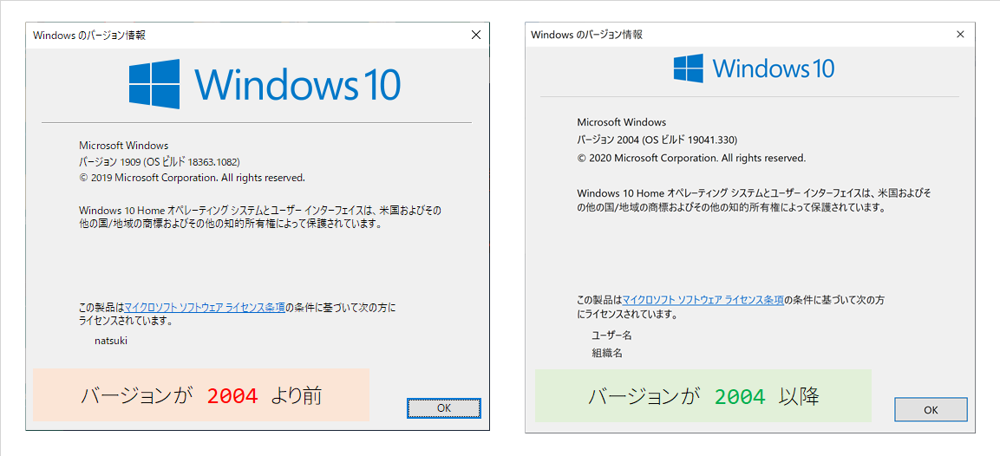

# Docker Toolbox 
レガシーな Windows 向けの Docker マネージメントツール、Docker Toolbox について説明する。
ここでは、Docker Toolbox で docker-compose ファイルを使ってコンテナを起動するところまで確認する。

## Docker Toolbox とは 
Docker Toolbox は、Docker Desktop for Windows アプリの最小システム要件を満たさない Windows システムで Docker を使用できるようにしてくれる ツール群のことである。

Docker Desktop for Windows アプリの最小システム要件は、Windows 10 Pro、Enterprise、Education エディションなので、一般的な Windows 10 Home エディションでは Docker Desktop for Windows は使えない。

Home エディションで通常の Docker が使えない理由は、Windows の仮想化機能 Hyper-V が使えないからである。

## Windows 10 バージョン 2004 以降について
ただし、Windows 10 のバージョン 2004 以降からは Home エディションでも Docker Desktop for Windows が使えるようになっている。

理由は、バージョン 2004 では WSL2 という機能を利用することで、Docker Desktop for Windows を使えるようになったためだ。 

WSL という Windows 内で仮想 Linux サーバを再現する技術（Windows Subsystem for Linux）を、バージョン 2004 では新規に WSL2 に更新することができる。

`2004` というバージョン番号の表記だが、これは `2020` 年の `04` 月期を意味している。

バージョン 2004 は 2020 年 5 月に向けて開発されたバージョンだが、2020 年 9 月 13 日の時点で一般的な Windows Update では、まだバージョン 2004 に更新されていない（Windows 10の新機能を公開前に試せる Windows Insider Program に参加している場合はバージョン 2004 が利用できている）。

## Windows 10 のバージョン確認方法
PowerSell で以下のコマンドを実行すると、新規ウィンドウが開き、バージョンを確認することができる。

```console 
winver
```

以下の参考画面では、左がバージョン 1909 （2019 年 9 月期）で、右がバージョン 2004（2020 年 4 月期）となっている。

バージョン 2004 以降なら Home エディションでも Docker Desktop for Windows を使うようにする。まだバージョンが 2004 に満たない場合は、以降の手順にしたがって Docker Toolbox を導入して Docker コンテナを利用できるようにする。



Docker Toolbox は、VirtualBox と 2 つの Docker モジュール（docker、docker-machine）を揃えることで利用できるようになる。また、複数のコンテナを 1 つの設定ファイルで簡単に管理できるようになる Docker Compose という機能を使うために、今回は docker-compose モジュールもインストールしておく。 

## VirtualBox のインストール
VirtualBox がまだインストールされていない場合は、Chocolatey で VirtualBox をインストールする。

Chocolatey を導入していない場合は、以下を参照する。

Chocolatey のインストール方法：  
https://github.com/fs5013-furi-sutao/explain.how_to_install_chocolatey

インストールするには、管理者で開いた PowerShell で以下のコマンドを実行する。

```console
choco install virtualbox
```

## Docker 類のインストール
Docker Toolbox を使うには、以下の 3 つのモジュールが必要になる。
- docker
- docker-machine
- docker-compose

今回はこれらを scoop でインストールする。


すでに Scoop を導入している場合は、以下のコマンドで Docker の3つのモジュールを一度にインストールができる。

```console
scoop install docker docker-machine docker-compose
```

これらのモジュールを Scoop でインストールすると、Docker Toolbox の GUI である Kitematic が同時にインストールされる。

## Kitematic の起動
インストールされた Kitematic を起動する。

 

## Docker Toolbox でのコンテナ構造
レガシーな（2004 より前のバージョン）Windows 10 では、Docker Toolbox を使う。

通常の Linux 向けの Docker と違い、Docker Toolbox は VirtualBox で作った default という初期 Virtual Machine の上に Docker コンテナを構築する。

そのため、Docker コンテナへ接続できる IP アドレスも、この default VM の IP アドレスになる。

## default VM の IP アドレスの確認方法
default VM の IP アドレスを確認するには、VirtualBox を立ち上げる。

以下の VirtualBox のホーム画面を見て分かる通り、Kitematic の初回起動により、default という VM が作成・実行されていることが分かる。


この default をダブルクリックすることで、default VM のコンソール画面が表示される。コンソールに、以下のコマンドを実行し、IP アドレスの情報を表示させる。

```console
ifconfig
```

以下の場合、default VM の IP アドレスが `192.168.99.100` であることが分かる。


また、このようなネットワーク情報は、以下のコマンドで PowerShell などで見ることもできる。

```console
VBoxManage guestproperty enumerate "default" | findstr IP
```

コマンド実行結果：
```
Name: /VirtualBox/GuestInfo/Net/0/V4/IP, value: 10.0.2.15, timestamp: 1599918604633024103, flags:
Name: /VirtualBox/GuestInfo/Net/2/V4/IP, value: 172.17.0.1, timestamp: 1599918604635956100, flags:
Name: /VirtualBox/GuestInfo/Net/1/V4/IP, value: 192.168.99.100, timestamp: 1599918604634001203, flags:
```

## Docker コンテナを起動してみる
試しに DB コンテナを起動してみる。今回は、以下のリポジトリを使って MySQL を動かす。

MySQL 8.0 コンテナの Docker Compose ファイル：  
https://github.com/fs5013-furi-sutao/fsedu.mysql.8.0

作業をしたいディレクトリに移動し、Git Bash で以下のコマンドを実行してリポジトリをクローンする。

```console
git clone https://github.com/fs5013-furi-sutao/fsedu.mysql.8.0.git
```

これで Docker を起動させるためのファイルは準備できたのだが、通常の PowerShell やコマンドプロンプト、Git Bash などでは、Docker を起動させるコマンドを実行できない。

Docker コマンドを実行するには、Docker CLI を利用する。

## Docker CLI
Docker CLI を起動するボタンは、Kitematic にある。Kitematic 画面の左下コーナーを見ると「Docker CLI」というボタンがあるので、これをクリックする。


Docker CLI ボタンを押すと、PowerShell が開く。この画面からのみ Docker コマンドを実行できる。

注意してほしいのは、通常の PowerShell では Docker コマンドを実行できない（Docker deamon につながらない）こと。Docker Toolbox 環境で Docker コマンドを実行したい場合は、必ずこの Kitematic の Docker CLI から実行する。

## Docker Compose の実行
まずはクローンしたリポジトリ内に移動する。デスクトップにリポジトリをクローンした場合は以下のようになる。

```console
cd C:\Users\＜ユーザ名＞\Desktop\fsedu.mysql.8.0\
```

そして、docker-compose コマンドで DB コンテナを起動させる。

バックグラウンドプロセスで Docker コンテナを起動：
```console
docker-compose up -d
```

`-d` オプションを付与することで、プロセスはコンソールに返され（コンソールを入力できる状態になることで分かる）、Docker コンテナの起動はバックグラウンドプロセスで行われる。

DB コンテナが起動状態は、Kitematic に表示される。


ただし、`-d` オプションを付けてバックグラウンドで Docker を起動させた場合は、コマンドの詳細な実行ログがコンソールに表示されない。Docker コンテナが正常に起動できない場合は、原因をログから調べるために `-d`　オプションなしで docker-compose up コマンドを実行すると良い。

詳細ログを表示させて Docker コンテナを起動：
```console
docker-compose up
```

## その他の Docker コンテナ制御コマンド

### Docker コンテナの停止

```console
docker-compose stop
```

### Docker コンテナの停止・削除（DBデータごと削除される）

```console
docker-compose down
```

Volume にマウントして永続化しているデータまで削除するには `--volume` オプションを付与する。

```console
docker-compose down --volume
```

### Docker コンテナの停止のみ

```console
docker-compose stop
```

### Docker コンテナ内への操作
以下は、`db` コンテナにログインする場合のコマンド
```console
docker-compose exec db bash
```

```console
# Docker コンテナ内にログインできた場合の待ち受け状態のターミナル
root@db-server:/#
```

Docker コンテナ内からログアウトするコマンド
```console
exit
```


